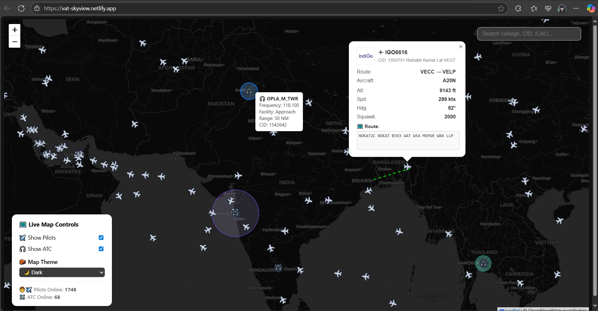

# ✈️ VATSIM Live Map Utility

A sleek and responsive web application to visualize **real-time pilots, ATC, and routes** on the [VATSIM](https://www.vatsim.net/) network. Built using **React**, **Leaflet**, and **Vite**, with support for hover tooltips, flight search, airport-to-airport routing, and map themes.

 <!-- Replace with your screenshot path -->

## 🚀 Features

- 🔎 **Live VATSIM Map** with pilots and ATC positions
- 📍 **Flight Route Visualization** from departure to arrival
- 🧭 **Pilot & ATC Hover Tooltips** with frequency, facility, and stats
- 🌍 **Multiple Map Themes** – Light / Dark / Satellite
- 🔗 **Shareable Links** to individual flights via `?callsign=XXXX`
- ✅ **Responsive & Smooth Performance** with view-based rendering
- 📦 Built with **Vite**, **React**, and **react-leaflet**

---

## 📸 Preview

https://vat-skyview.netlify.app/

---

## 📦 Tech Stack

- ⚛️ React (JSX)
- 🗺️ React Leaflet & Leaflet.js
- ⚡ Vite
- 🧭 Custom Airport Database (JSON)
- 📡 VATSIM Public API

---

## 🧑‍💻 Getting Started

```bash
git clone https://github.com/aditya-2403/skyview-xiondrey.git
cd skyview-xiondrey
npm install
npm run dev
```

##  Code Merges

```bash
git checkout dev
```

- All code merges to be done in dev branch!
